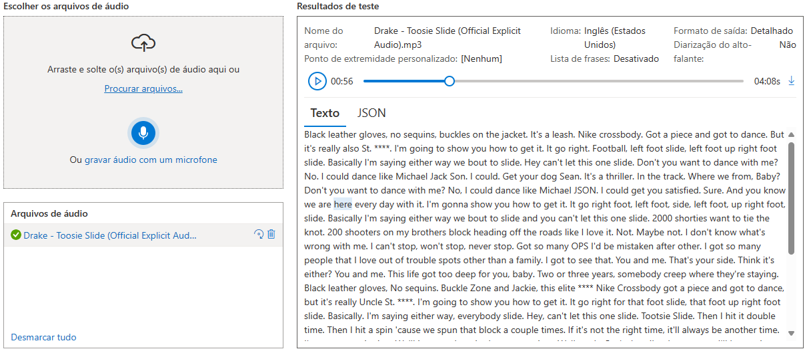
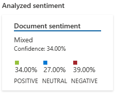

# 🗣️ Microsoft-Azure-Speech

## 🔍 How Use

- First you create your account on Microsoft: Azure, after this we can create a new Resource and try this AI.

- Just read the documentation to do this.

## 🤓 Possibility

- This AI is incredible, we can use there to translate chats, games, films, everything !!!

- I used it to analyse Drake's music, but i'm excited to use it to create and project oto translate game chats and analyse.

- It can analyse feelings good / neutral / bad.

## ✍️ Test

- First step I use it to transcribe Drake's music - TOOSIE SLIDE, [Convert speech and text on real time](https://speech.microsoft.com/portal/6390c82008924983b74751f3a5ff9f27/speechtotexttool).

##

- Second step I copy and paste this on [Analyze sentiment and opinions](https://language.cognitive.azure.com/tryout/sentiment), from [Cognitive Studio](https://language.cognitive.azure.com/home), to analyse his sentiments and opinions.

## 📖 Documentation

- [**Microsoft: Azure doc**](https://learn.microsoft.com/en-us/azure/ai-services/computer-vision/concept-ocr)

- [**Microsoft: Azure Speech Studio doc**](https://microsoftlearning.github.io/mslearn-ai-fundamentals/Instructions/Labs/09-speech.html)

- [**Analyze text with Language Studio**](https://microsoftlearning.github.io/mslearn-ai-fundamentals/Instructions/Labs/06-text-analysis.html)

- [**DIO Class**](https://web.dio.me/lab/trabalhando-com-machine-learning-na-pratica-no-azure-ml/learning/88f82571-5450-40a9-9f4d-253416f2530e)